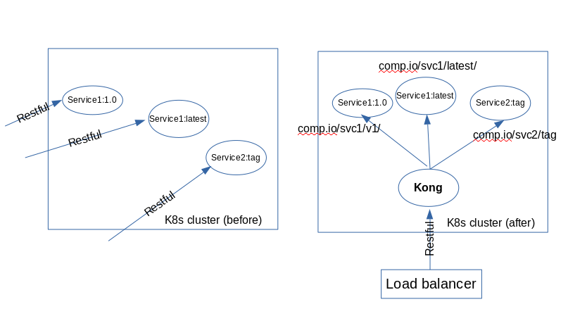

# apihub

**Deploy APIs Made Easy**

## What is this

**apihub** is a thin layer on top of kubernetes cluster to expose and manage Restful-style microservices for external usage. It's major(or small) contribution is to easily add a restful API service to a API gateway ([kong](https://getkong.org) for now). Its usages include:

1. Build a small CAAS (Container-as-a-service) infrastructure
1. Set up a local microservice API testbed for CI
1. Save money for using only one TLS certficates (;-)); for all microservices are under the same URL (Kong proxy).
1. more ...



## Features
* A mordern Go CLI interface ([cobra](https://github.com/spf13/cobra/)) to wrap the raw kong API calls
* Made it easy to add API plugins (authorization, rate limit) for Restful API.

## Prerequisite

We assume you already have:
* A running kubernetes cluster
* [Tiller](https://github.com/kubernetes/helm) is running as a service and local host has helm installed (TODO remove this requirement)
* A bunch of restful docker images that you would like to serve, in an organized way

## To Build

```bash
# Make sure you have go tool
cd $GOPATH/src
mkdir -p github.com/codemk8/
cd github.com/codemk8/
git clone https://github.com/codemk8/apihub.git
cd apihub
make
# It'll generate a bin/ap binary
```
## To Use

```bash
cd $GOPATH/src/github.com/codemk8/apihub
make
# Firstly do a quick check to see if prerequisites are satisfied
$ ./bin/ap check  
2018/03/13 00:08:33 Found 19 pods in the cluster, checking OK.
NAME            REVISION        UPDATED                         STATUS          CHART           NAMESPACE
apihub-kong     1               Mon Mar 12 00:49:31 2018        DEPLOYED        kong-0.1.2      default

NAME    URL
stable  https://kubernetes-charts.storage.googleapis.com
local   http://127.0.0.1:8879/charts
# Then init the system, including persistent volumes (not fully supported yet), kong service
$ ./bin/ap init
...
# Deploy a clusterIP service in the kubernetes as you normally do with kubectl. Following example use echoserver:
$ kubectl create -f docs/manual/echoserver/echoserver.yaml
$ kubectl get services 
NAME                       TYPE    CLUSTER-IP      EXTERNAL-IP   PORT(S)     AGE
apihub-kong-kong-admin  NodePort  172.30.250.49    <none>    8444:32444/TCP  23h
apihub-kong-kong-proxy  NodePort  172.30.109.2     <none>    8443:32443/TCP  23h
apihub-kong-postgresql  ClusterIP 172.30.220.61    <none>    5432/TCP        23h
http-echoserver         ClusterIP 172.30.110.244   <none>    80/TCP          11d

# Ready to deploy, run 'ap deploy -h' for detailed usage
$ ./bin/ap deploy http-echoserver --name=my_echo --uris=echo/v1
2018/03/13 00:21:45 Successfully executed Deploy command.

# test the echoserver, note to use the Kong proxy's NodePort, 
# Replace localhost with your real kubernetes host
$ curl -k http://localhost:32443/echo/v1
...

# (Optional) Delete an exposed API
$ ./bin/ap delete my_echo

# list APIs
$ ./bin/ap list
+---------+---------------------------+----------+----------+
| NAME    |        UPSTREAMURL        | STRIPURI | URIS     |
+---------+---------------------------+----------+----------+
| my_echo | http://http-echoserver:80 | true     | /echo/v1 |
+---------+---------------------------+----------+----------+
|                                        TOTAL   |   1      |
+---------+---------------------------+----------+----------+

```

## TODOs

* More sophisticated API management including version, tagging.
* Make the tool itself a Restful API service so that fancier web UI can be built as a frontend.
* Improve usability
* Expose more features of Kong API.
* Try other API gateways, or just use Kubernetes Ingress
* Test in medium-scaled clusters.
